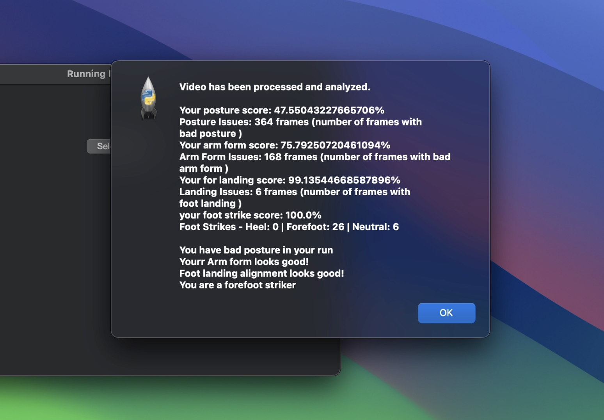

# Running Form Analyzer


**GitHub:** https://github.com/19166681/FinalProject

Analyses treadmill running technique from video using a custom-trained YOLOv8 pose estimation model. Four biomechanical metrics are scored in real time and displayed as percentages via a desktop GUI.

---

## Demo

> Generate `demo.gif` by running `python make_demo_gif.py` after processing a video, then commit it.


---

## What it analyses

| Metric | What is measured | Target |
|---|---|---|
| **Posture** | Shoulder–hip–knee angle to detect forward lean | ≥ 150° |
| **Arm form** | Elbow angle to check arm bend | < 110° |
| **Foot strike** | Classifies each step: heel / forefoot / neutral | Forefoot or neutral |
| **Foot landing** | Hip-to-foot horizontal distance to detect overstriding | < 200 px |

---

## How it works

```
Video input
    │
    ▼
YOLOv8 pose model (best.pt)
    │  detects 15 custom keypoints per frame
    ▼
RunningAnalysis engine
    │  calculates angles and distances from keypoints
    ▼
Tkinter GUI
    │  shows percentage scores + feedback per metric
    ▼
Annotated output video + JSON keypoint data
```

**15 custom keypoints:** forehead, shoulder, left/right elbow, left/right wrist, hip, left/right knee, left/right ankle, left/right heel, left/right toe.

---

## Custom model training

The pose model was trained from scratch on a custom-annotated dataset of running footage:

| | |
|---|---|
| **Dataset** | 682 annotated frames (486 general running + 196 treadmill-specific) |
| **Keypoints** | 15 custom landmarks (standard COCO has 17 but no heel/toe) |
| **Training runs** | 6 iterations with CometML experiment tracking |
| **Epochs** | 50 |
| **Best pose mAP@50** | ~0.43 |
| **Weights file** | `best.pt` (85 MB) |

Training curves: [`runs/pose/train6/results.png`](runs/pose/train6/results.png)

---

## Screenshots

> Take a screenshot of the results pop-up window and save it as `docs/results_screenshot.png`, then it will appear here.



---

## Installation

```bash
pip install -r requirements.txt
```

Requires Python 3.8+. A CUDA-capable GPU is recommended for faster frame processing.

---

## Usage

```bash
python main.py
```

1. A window opens — click **Select Video**
2. Choose an `.mp4`, `.avi`, or `.mov` file of someone running on a treadmill
3. Processing runs frame-by-frame (progress printed to console)
4. A results window opens showing percentage scores for each metric

The trained weights file `best.pt` must be in the same directory as `main.py`.

---

## Output

| File | Description |
|---|---|
| `data/runs/output_video.avi` | Annotated video with pose skeleton overlaid |
| `data/runs/run_N.json` | Per-frame keypoint coordinates and confidence values |
| GUI pop-up | Posture / arm form / foot strike / foot landing scores |

---

## Project structure

```
FinalProject/
├── main.py                 # GUI entry point (Tkinter)
├── running_analysis.py     # Biomechanics calculations (posture, arm, strike, landing)
├── videoManager.py         # COCO → YOLO annotation converter (used during training)
├── best.pt                 # Custom-trained YOLOv8 pose weights
├── training.yml            # Training config (15 keypoints)
├── trainingTreadmil.yml    # Treadmill-specific training config
├── requirements.txt
├── make_demo_gif.py        # Generates demo.gif from output frames
├── data/runs/              # Output video and JSON keypoints
├── train/                  # General running training dataset
├── trainTreadmill/         # Treadmill-specific training dataset
└── runs/pose/train6/       # Final training run — weights, metrics, plots
```

---

## Tech stack

Python · OpenCV · YOLOv8 (Ultralytics) · PyTorch · Tkinter · NumPy · CometML
